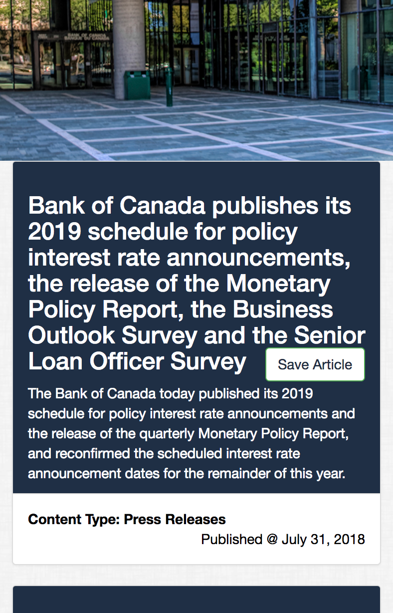

# mongoHeadlines app
A web app that lets users view and leave comments on the most recent Bank of Canada news. 

# getting started
[headlinesBankofCanada](https://headlinesbankofcanada.herokuapp.com/) 

# app highlights

## Home Page 

### touch any button to begin ...

### ... and scroll down to read new articles from Bank of Canada

### you can save any article you prefer and read it later in the Saved Articles Page

## Touch any home page button to begin and scroll down to see more

## The app is fully responsive

 

#### The app requires node.JS, including npm dependencies:

* [node.js](https://nodejs.org/en/)
* [handlebars](http://handlebarsjs.com/)
* [mongoDB](https://www.mongodb.com/download-center#community)
* [mongoose](http://mongoosejs.com/docs/)
* [express NPM Package](https://www.npmjs.com/package/express)
* [express-handlebars NPM Package](https://www.npmjs.com/package/express-handlebars)
* [cheerio NPM Package](https://www.npmjs.com/package/cheerio)
* [body-parser NPM Package](https://www.npmjs.com/package/body-parser)
* [morgan NPM Package](https://www.npmjs.com/package/morgan)
* [request NPM Package](https://www.npmjs.com/package/request)

Run `npm init`. When finished, install and save these npm packages. This shall return the PORT: 3000. Then, run the app in your local browser @ http://localhost:3000/ . Alternatively, access this app in HEROKU @ 
[headlinesBankofCanada](https://headlinesbankofcanada.herokuapp.com/) 

#### How can I make it better? Review for dry code.

---

* **Angelina Davies – August 2018** - *ExpressHandlebars/MongoDB/CSS/JS/Node.js* - [Angelina Davies](https://github.com/angelyna)

